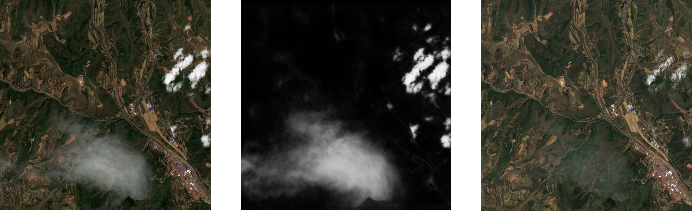
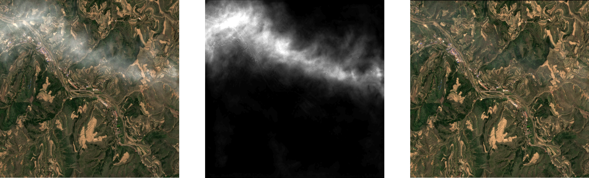
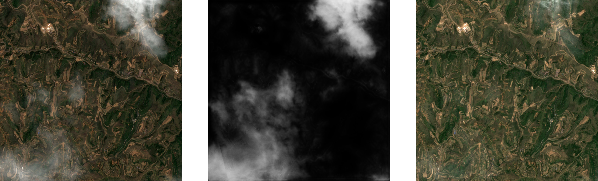

<h1 align="center">SCM-CNN: Cloud-matting and Cloud-removal</h1>

## 🔶Description:
A method for thin cloud removal from a single image of Sentinel-2 was developed, which can effectively perform cloud segmentation and evaluate cloud thickness. We use the Image-Matting method to de-cloud and enhance remote sensing images.


# Sample Demo:
## Demo 1:
<div align="center"></div>

## Demo 2:
<div align="center"></div>

## Demo 3:
<div align="center"></div>


## How to use？
### Train
```shell
python train.py --trainDir ./data/train_dataset --testDir ./data/test_dataset --saveDir ./modelSave
```
**For more details please refer to` train.get_args()`** 😲
### Prediction
If you want to infer an entire remote sensing image use (large image):
```shell
python modelpre --Image_path "Image path" --ckpt "ckpt path" --saveDir "Save path" 
```
If you want to infer on a set of sliced images use (small images):
```shell
python modelpre --preDir "Image Dir" --ckpt "ckpt path" --saveDir "Save path"
```


## Cloud-Matting Dataset && Model Weight
**The paper is in the submission stage. After the paper is accepted, we will publish the model weights and dataset.**


## CONTACT US

Contact me if you have any questions about the code and its execution.

E-mail: mrwurenzhe@gmail.com


## 📜 Citations

```
@article{,
  title   =
  author  = 
  journal = 
  year    = 
}
```

